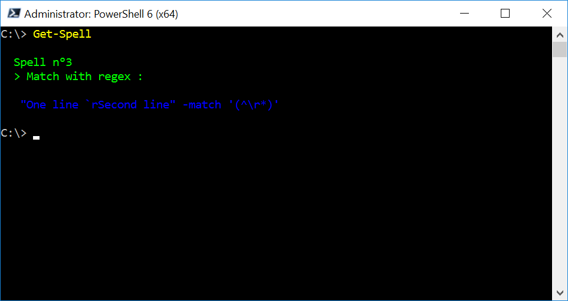

# PowerShell-Spells

PowerShell Spells is a project that pretend collect on-liner tricks (spells) to use with PowerShell. The main reason is expand the knowledge of the language and a fun information for check without left the console.

## Table of Contents
- [PowerShell-Spells](#powershell-spells)
  - [Table of Contents](#table-of-contents)
  - [Usage](#usage)
    - [Installation](#installation)
    - [Get the Spells](#get-the-spells)
  - [Contributing](#contributing)

## Usage

### Installation

You can install the module from the [PowerShell Gallery](https://www.powershellgallery.com/) with the following command:

`Install-Module PowerShell-Spells`

### Get the Spells

First, you can add the module to your profile, adding the line:

`Import-Module PowerShell-Spells`

***Note:***
*To edit your profile you can run: `code $PROFILE` (if you have VSCode installed).*

So then, you add the command to invoke a Spell:

`Get-Spell`

## Contributing

Contributions are more than welcome! 🚀💻 Feel free to participate via pull requests or issues.